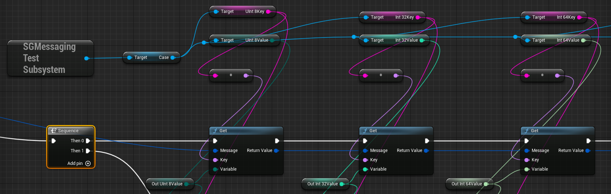
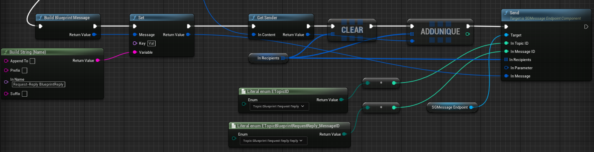

# 准备

插件是在UnrealEngine5正式版上进行的开发，所以在UnrealEngine4下使用会出现部分编译错误以及示例蓝图无法打开问题。

UnrealEngine自带的Messagebus使用说明参考[MessageBusDemo](https://github.com/crazytuzi/MessageBusDemo)。

# 安装

复制`Plugins`目录到工程根目录。

# API

## C++

- 全局MessageEndpoint

```cpp
const auto MessageEndpoint = USGMessageFunctionLibrary::GetDefaultMessageEndpoint(this);
```

每个World下都有一个MessageEndpoint，用于广播工作模式。

- MessageEndpoint组件

针对点对点工作模式，需要接收方持有USGMessageEndpointComponent。

- 消息参数

    - 发送消息参数
    
        - "Key1",Value1,"Key2",Value2,...，如"BoolValue",true,"IntValue",1。
        
    - 接收消息参数
    
        - Message.Get\<Type\>(Key)，如Message.Get\<bool\>("BoolValue")。

- Subscribe

    - 示例
    
    ```cpp
    if (const auto MessageEndpoint = USGMessageFunctionLibrary::GetDefaultMessageEndpoint(this))
    {
    	MessageEndpoint->Subscribe(Topic_PublishSubscribe, TopicPublishSubscribe_Publish, this,
    	                           &ASGTestPublishSubscribe::OnPublish);
    }
    ```
    
    - 参数
    
        - InTopicID：主题号
    
        - InMessageID：消息号
    
        - Handler：句柄
    
        - HandlerFunc：回调函数
    
            - 函数原型
    
            ```cpp
            void (HandlerType::*FuncType)(const MessageType&, const TSharedRef<ISGMessageContext, ESPMode::ThreadSafe>&);
            ```
    
        - InScope：消息范围，默认值为Thread，即当前线程

- Publish

    - 示例

    ```cpp
    if (const auto MessageEndpoint = USGMessageFunctionLibrary::GetDefaultMessageEndpoint(this))
	{
		MessageEndpoint->Publish(Topic_PublishSubscribe, TopicPublishSubscribe_Publish, DEFAULT_PUBLISH_PARAMETER,
		                         "Val",
		                         FString("Publish-Subscribe Publish"));
	}
    ```

    - 参数

        - InTopicID：主题号

        - InMessageID：消息号

        - InParameter：Publish参数
        
            - Scope：消息范围

            - Annotations：消息注解

            - Delay：消息延时

            - Expiration：消息时限

        - Params：消息参数

- Send

    - 示例

    ```cpp
    if (MessageEndpointComponent != nullptr)
	{
		MessageEndpointComponent->Send(Topic_RequestReply, TopicRequestReply_Reply, Context->GetSender(),
		                               DEFAULT_SEND_PARAMETER,
		                               "Val", FString("Request-Reply Reply"));
	}
    ```

    - 参数

        - InTopicID：主题号

        - InMessageID：消息号

        - InRecipient/InRecipients：单/多个消息订阅地址

        - InParameter：Send参数

            - Flags：消息标志

            - Annotations：消息注解

            - Attachment：附加内容

            - Delay：消息延时

            - Expiration：消息时限

        - Params：消息参数

- Forward

    - 示例

    ```cpp
    TArray<FSGMessageAddress> Recipients;

	for (TActorIterator<ASGTestForward> Iterator(GetWorld()); Iterator; ++Iterator)
	{
		if (const auto Component = Cast<USGMessageEndpointComponent>(
			Iterator->GetComponentByClass(USGMessageEndpointComponent::StaticClass())))
		{
			Recipients.Add(Component->GetAddress());
		}
	}

	if (MessageEndpointComponent != nullptr)
	{
		MessageEndpointComponent->Forward(Context, Recipients);
	}
    ```

    - 参数

        - InContext：消息上下文

        - InRecipients：消息订阅地址

        - InDelay：消息延时

- Unsubscribe

    - 示例

    ```cpp
    if (const auto MessageEndpoint = USGMessageFunctionLibrary::GetDefaultMessageEndpoint(this))
	{
		MessageEndpoint->Unsubscribe(Topic_Unsubscribe, TopicUnsubscribe_Cpp, this, &ASGTestCppUnsubscribe::OnPublish);
	}
    ```

    - 参数

        - InTopicID：主题号

        - InMessageID：消息号

        - Handler：句柄

        - HandlerFunc：成员函数

## Blueprint

- 全局MessageEndpoint

    

- 消息参数

    - 发送消息参数

        - 示例

            

        - 参数

            - Key：参数名

            - Variable：任意类型变量

    - 接收消息参数

        - 示例

            

        - 参数

            - Key：参数名

            - Variable：任意类型变量

- Subscribe

    - 示例

        

    - 参数

        - InTopicID：主题号

        - InMessageID：消息号

        - InDelegate：消息代理

            - 代理原型

            ```cpp
            DECLARE_DYNAMIC_DELEGATE_TwoParams(FSGBlueprintMessageDelegate, const FSGBlueprintMessage&, Message,
                                   const FSGBlueprintMessageContext&, Context);
            ```

        - InScope：消息范围，默认值为Thread，即当前线程

- Publish

    - 示例

        
    
    - 参数

        - InTopicID：主题号

        - InMessageID：消息号

        - InParameter：Publish参数

            - Scope：消息范围

            - Annotations：消息注解

            - Delay：消息延时

            - Expiration：消息时限

        - InMessage：消息参数

- Send

    - 示例

        

    - 参数

        - InTopicID：主题号

        - InMessageID：消息号

        - InRecipients：消息订阅地址

        - InParameter：Send参数

            - Flags：消息标志

            - Annotations：消息注解

            - Attachment：附加内容

            - Delay：消息延时

            - Expiration：消息时限

        - InMessage：消息参数

- Forward

    - 示例

        
    
    - 参数

      - InContext：消息上下文

      - InRecipients：消息订阅地址

      - InDelay：消息延时

- Unsubscribe

    - 示例

        

    - 参数

        - InTopicID：主题号

        - InMessageID：消息号

        - InDelegate：消息代理


